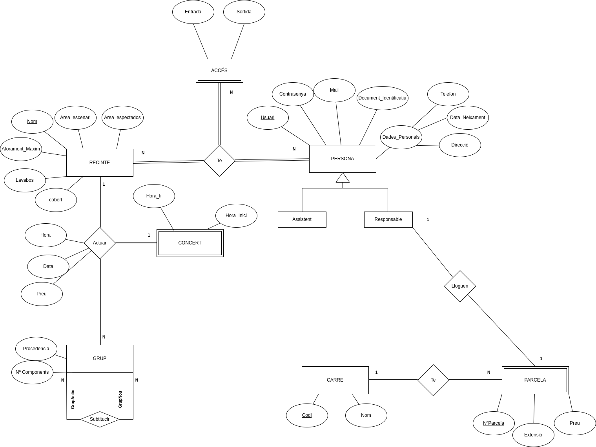

DISSENY DDBB
============

Aquest document és per donar explicacions de les relacions i de les decisions preses per arribar a aquest resultat final.

*EXPLICACIO:

Per començar, parlarem de les entitats dèbils (CONCERT, PARCEL·LA, ACCÉS), les he posades dèbils perquè depenen de les altres entitats: concert depèn que un grup toqui a un recinte, Parcel·la depèn del carrer, ja que de no ser així hi hauria parcel·les amb el mateix Núm. i per últim l'Accés depèn de les persones que surtin i entrin.

Quant a la relació "Actuar", he decidit que agafi els atributs data, preu, hora perquè aquests van donats per cada instància, és a dir, per a cada connexió; per exemple, el preu canviarà, no és fix, per cada concert que faci un grup tindrà un preu diferent. I el mateix per les altres dades.

Per últim, l'especialització és perquè l'únic que lloga és el responsable.

